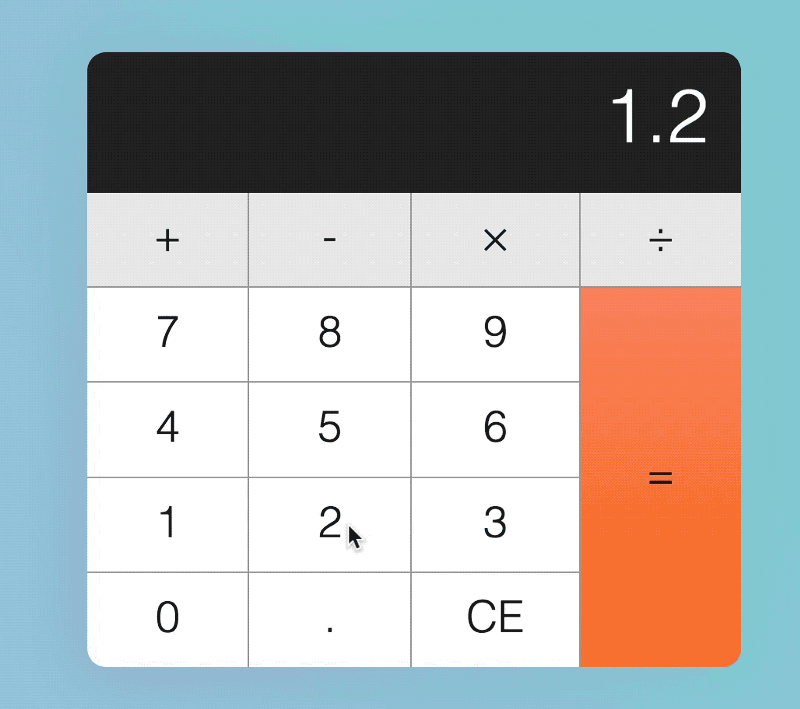

# Calculator : FE Challenge : Total Brain



Before referencing online resources, first demonstrate the knowledge you possess without Google.

## Getting Started

```
yarn install
```

```
yarn start
```

### 1. Happy path

Let's consider what the average person would do when they pick up a calculator. This “what the average person would do" is called the happy path.

Let's call our average person Mary.

When Mary picks up a calculator, she could hit any of these keys:

1. a number key (0–9)
2. an operator key (+, -, ×, ÷)
3. the decimal key
4. the equal key
5. the clear key

Refactor the markup into components and begin implementing the expected functionality to allow Mary to use the calculator.


### 2. Edge Cases

The happy path isn't enough. To build a calculator that’s robust, you need to make your calculator resilient to weird input patterns. To do so, you have to imagine a troublemaker who tries to break your calculator by hitting keys in the wrong order.

Think of how a troublemaker could break your calculator. Consider the edge cases including:

1. Decimal on decimal
2. Operator key first
3. equals before operator

Rework your code to account for edge cases.

### 3. Refactoring the code

Take a moment to review your code. How can it be better? Refactor your code and consider using the following, if you are not already:

1. Early returns
2. Ternary operators
3. Pure functions
4. Destructuring
# 8_2_calc_interview
